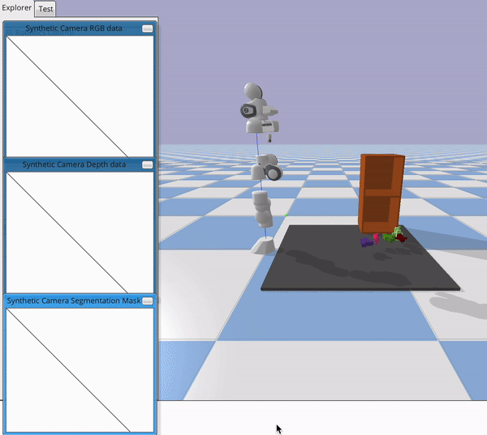
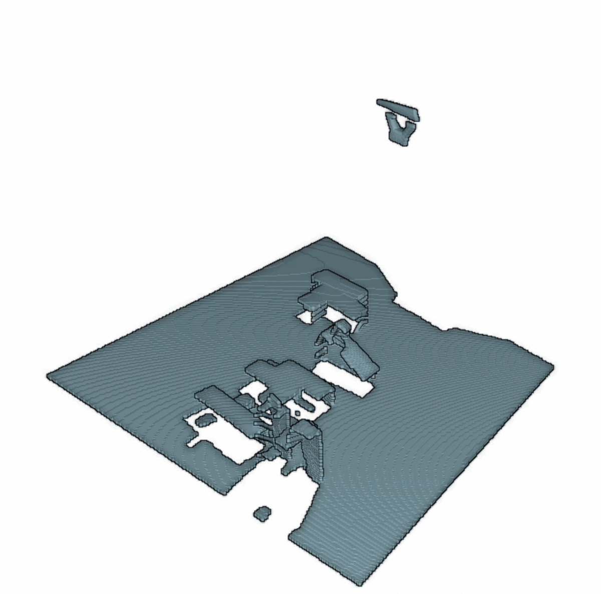

# Pybullet Playground

This repository is for pybullet development of visual-based manipulation tasks.

### TODO:
- Scene probing at more locations
- Better robot trajectory: to optimize the trajectory to collect the least amount of point clouds to cover the scene.

### Scene Probing

The panda arm moves its wrist joint to capture depth images from the scene and convert these into the scene point cloud. 

### panda_w_camera.py

The new point clouds are added to the buffer as the camera moves. 

This shows simple robot camera trajectory. Moves joint 4 by a certain degree every time step.

Capture point cloud every 20 timesteps. This shows the progress of scene point cloud developing. As the camera looks toward the shelf, the shelf point cloud gets filled. Caveat: the ratio between the point clouds in this gif need to be fixed.

### pointcloud_test.ipynb

Test code to convert a pair of color+depth images into a single point cloud data using open3D. The camera to robot base transformation is currently not working.
